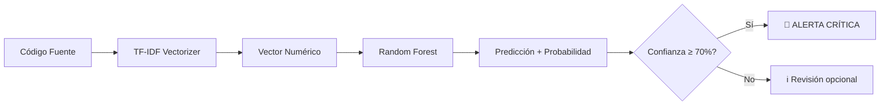

# 🔍 SEMMA Vulnerability Detection System


Sistema de detección automática de vulnerabilidades en código fuente usando **Machine Learning** y la metodología **SEMMA** (Sample, Explore, Modify, Model, Assess).

## � Tabla de Contenidos

- [Características](#-características)
- [Tipos de Vulnerabilidades Detectadas](#-tipos-de-vulnerabilidades-detectadas)
- [Requisitos](#-requisitos)
- [Instalación](#-instalación)
- [Uso Rápido](#-uso-rápido)
- [Cómo Funciona](#-cómo-funciona)
- [Estructura del Proyecto](#-estructura-del-proyecto)
- [Uso Detallado](#-uso-detallado)
- [Entrenar con Tus Propios Datos](#-entrenar-con-tus-propios-datos)
- [Cómo Funciona el Modelo](#-cómo-funciona-el-modelo)
- [Interpretar Resultados](#-interpretar-resultados)
- [Mejores Prácticas](#-mejores-prácticas)
- [Limitaciones](#-limitaciones)
- [Contribuir](#-contribuir)

---

## ✨ Características

- 🤖 **Detección automática** de 7 tipos de vulnerabilidades usando Random Forest
- 🎨 **Interfaz visual mejorada** con colores, emojis y barras de probabilidad
- 📊 **Pipeline completo** desde recolección de datos hasta predicción
- 🔄 **Recolección automatizada** de PoCs desde GitHub
- 🎯 **Mapeo CVE→Tipo** para vulnerabilidades conocidas
- 📈 **Métricas detalladas** de evaluación del modelo
- 🚀 **Fácil de extender** con nuevos datos

---

## 🏷️ Tipos de Vulnerabilidades Detectadas

| Emoji | Categoría | Descripción | Severidad |
|-------|-----------|-------------|-----------|
| 💉 | **SQL Injection** | Inyección de comandos SQL en consultas | CRÍTICA |
| 🌐 | **Cross-Site Scripting (XSS)** | Ejecución de scripts maliciosos en navegadores | ALTA |
| 💣 | **Remote Code Execution (RCE)** | Ejecución remota de código arbitrario | CRÍTICA |
| 📂 | **Path Traversal** | Acceso no autorizado a archivos del sistema | ALTA |
| 📦 | **Unsafe Deserialization** | Deserialización insegura de objetos | CRÍTICA |
| 🔓 | **Weak Cryptography** | Uso de algoritmos criptográficos débiles | MEDIA |
| ⚠️ | **Otra Vulnerabilidad** | Vulnerabilidad no clasificada | VARIABLE |
| ✅ | **Código Seguro** | Sin vulnerabilidades detectadas | NINGUNA |

---

## 📦 Requisitos

- **Python:** 3.8 o superior
- **Sistema Operativo:** Linux, macOS, o Windows con WSL
- **Git:** Para clonar repositorios de PoCs (opcional pero recomendado)
- **Searchsploit:** Para búsqueda de exploits (opcional)

### Dependencias Python

```
pandas>=1.5.0
scikit-learn>=1.2.0
joblib>=1.2.0
numpy>=1.23.0
```

---

## 🚀 Instalación

### 1. Clonar el repositorio

```bash
git clone https://github.com/tu-usuario/semma-vulnerability-detection.git
cd semma-vulnerability-detection
```

### 2. Crear un entorno virtual (recomendado)

```bash
python3 -m venv .venv
source .venv/bin/activate  # En Windows: .venv\Scripts\activate
```

### 3. Instalar dependencias

```bash
pip install -r requirements.txt
```

### 4. Verificar instalación

```bash
python3 --version  # Debe ser 3.8+
pip list | grep scikit-learn  # Verificar que está instalado
```

---

## ⚡ Uso Rápido

### Opción 1: Usar el modelo pre-entrenado

Si ya hay un modelo entrenado en `models/model_rf.pkl`:

```bash
python3 scripts/7_detect_file.py examples/vulnerable_rce.py
```

### Opción 2: Entrenar desde cero

```bash
cd scripts
./pipeline.sh
```

Esto ejecutará automáticamente:
1. Descarga de PoCs desde GitHub
2. Generación del dataset
3. Entrenamiento del modelo
4. Ya está listo para detectar!

---

## 🔬 Cómo Funciona

### Metodología SEMMA

Este proyecto implementa la metodología **SEMMA** de SAS para minería de datos:

```
┌─────────────────────────────────────────────────────────┐
│  1. SAMPLE    → Recolección de datos (PoCs + Safe code) │
│  2. EXPLORE   → Análisis y etiquetado automático        │
│  3. MODIFY    → Transformación TF-IDF (vectorización)   │
│  4. MODEL     → Entrenamiento Random Forest             │
│  5. ASSESS    → Evaluación con métricas                 │
└─────────────────────────────────────────────────────────┘
```

### Flujo del Sistema



---

## 📁 Estructura del Proyecto

```
SEMMA/
│
├── 📂 dataset/                    # Datos de entrenamiento
│   ├── github_poc/                # PoCs descargados de GitHub (CVE-2021-44228, etc.)
│   ├── searchsploit/              # Exploits de searchsploit (opcional)
│   ├── safe_code/                 # ⭐ AQUÍ va tu código seguro
│   ├── samples.csv                # Dataset generado (id, source, file_path, cve, code, label)
│   └── features/
│       └── features_tfidf.csv     # Features vectorizadas (5000 columnas)
│
├── 📂 models/                     # Modelos entrenados
│   ├── model_rf.pkl               # Random Forest entrenado
│   └── vectorizer.pkl             # TF-IDF vectorizer
│
├── 📂 scripts/                    # Scripts principales
│   ├── 0_config.sh                # Configuración (CVEs, rutas)
│   ├── 1_github_poc.sh            # Descarga PoCs de GitHub
│   ├── 2_searchsploit.sh          # Busca exploits en searchsploit
│   ├── 5_make_features.py         # 🔧 Genera dataset + features
│   ├── 6_train_model.py           # 🎓 Entrena el modelo
│   ├── 7_detect_file.py           # 🔍 Detecta vulnerabilidades
│   └── pipeline.sh                # Pipeline completo automatizado
│
├── 📂 examples/                   # ⭐ Ejemplos de prueba
│   ├── vulnerable_rce.py          # Ejemplo de RCE
│   ├── vulnerable_xss.js          # Ejemplo de XSS
│   ├── vulnerable_sqli.php        # Ejemplo de SQL Injection
│   └── safe_code.py               # Ejemplo de código seguro
│
├── 📄 requirements.txt            # Dependencias Python
├── 📄 README.md                   # Este archivo
└── 📄 .gitignore                  # Archivos ignorados por Git
```

---

## 📖 Uso Detallado

### 1️⃣ Recolectar Datos (Opcional si ya tienes PoCs)

#### Descargar PoCs de GitHub

```bash
cd scripts
./1_github_poc.sh
```

**¿Qué hace?**
- Descarga repositorios de PoCs para CVEs conocidos
- Los guarda en `dataset/github_poc/CVE-XXXX-XXXX/`
- Actualmente incluye: Log4Shell, Zerologon, BlueKeep, etc.

**¿Cómo agregar más CVEs?**

Edita `scripts/0_config.sh` y agrega tu CVE:

```bash
declare -A POC_REPOS=(
    ["CVE-2023-38831"]="https://github.com/d47d3v1lr/CVE-2023-38831"
    ["TU-NUEVO-CVE"]="https://github.com/usuario/repo-poc"
)
```

#### Buscar exploits con Searchsploit (Opcional)

```bash
./2_searchsploit.sh
```

Requiere tener instalado `exploitdb`:
```bash
sudo apt install exploitdb  # En Debian/Ubuntu
```

### 2️⃣ Generar Dataset y Features

```bash
python3 5_make_features.py
```

**¿Qué hace este script?**

1. **Lee archivos** de:
   - `dataset/github_poc/` (PoCs vulnerables)
   - `dataset/safe_code/` (código seguro)
   - `examples/` (ejemplos manuales)

2. **Etiqueta automáticamente** usando patrones regex:
   - `SELECT ... FROM` → `sqli`
   - `<script>` → `xss`
   - `system(` → `rce`
   - etc.

3. **Mapea CVEs conocidos** al tipo correcto:
   ```python
   CVE-2021-44228 → rce  # Log4Shell
   CVE-2020-1472  → rce  # Zerologon
   ```

4. **Genera archivos**:
   - `dataset/samples.csv` - Dataset completo
   - `dataset/features/features_tfidf.csv` - Features vectorizadas
   - `models/vectorizer.pkl` - Vectorizer para nuevas predicciones

**Salida esperada:**
```
[+] Total de muestras: 31
[+] Distribución de clases:
rce           24
safe           4
xss            1
sqli           1
other_vuln     1
```

### 3️⃣ Entrenar el Modelo

```bash
python3 6_train_model.py
```

**¿Qué hace?**

1. Lee `dataset/features/features_tfidf.csv`
2. Divide en train (80%) y test (20%)
3. Entrena un **Random Forest** con:
   - 200 árboles de decisión
   - Profundidad máxima de 20
   - Balanceo de clases automático
4. Evalúa métricas (precision, recall, F1-score)
5. Guarda `models/model_rf.pkl`

**Salida esperada:**
```
=== Classification Report ===
              precision    recall  f1-score   support
         rce     0.7143    1.0000    0.8333         5
        safe     0.0000    0.0000    0.0000         2

=== Top 20 features importantes ===
var                             0.03628
function                        0.02663
document                        0.02140
password                        0.01923
```

### 4️⃣ Detectar Vulnerabilidades

```bash
python3 7_detect_file.py /ruta/al/archivo.py
```

**Ejemplos:**

```bash
# Analizar ejemplo de RCE
python3 7_detect_file.py ../examples/vulnerable_rce.py

# Analizar tu propio código
python3 7_detect_file.py /home/usuario/mi_proyecto/app.py

# Analizar archivo PHP
python3 7_detect_file.py ../examples/vulnerable_sqli.php
```

**Salida:**

```
======================================================================
  🔍 DETECTOR DE VULNERABILIDADES - SEMMA ML Security Scanner
======================================================================

📄 Archivo: ../examples/vulnerable_rce.py
📊 Tamaño: 542 bytes

🎯 CATEGORÍA DETECTADA:
   💣 Remote Code Execution
   Descripción: Ejecución remota de código arbitrario en el sistema
   Severidad: CRÍTICA

📈 DISTRIBUCIÓN DE PROBABILIDADES:

   💣 rce                   58.00% ███████████████████████░░░░░░░░░░░░░░░░░
   🌐 xss                   21.50% ████████░░░░░░░░░░░░░░░░░░░░░░░░░░░░░░░░
   💉 sqli                  10.50% ████░░░░░░░░░░░░░░░░░░░░░░░░░░░░░░░░░░░░
   ✅ safe                   8.00% ███░░░░░░░░░░░░░░░░░░░░░░░░░░░░░░░░░░░░░

⚡ ADVERTENCIA - Posible Vulnerabilidad
Tipo: Remote Code Execution
Confianza: 58.00%

📋 ACCIÓN RECOMENDADA:
   • Revisión manual recomendada
   • Verificar contexto del código
   • Considerar análisis adicional
```

---

## 🎯 Entrenar con Tus Propios Datos

### Agregar Código Seguro

```bash
# Copiar tu proyecto seguro
cp -r /ruta/a/tu/proyecto dataset/safe_code/mi_proyecto

# O crear archivo individual
cat > dataset/safe_code/ejemplo.py << 'EOF'
def secure_function(user_input):
    # Validación segura
    if not isinstance(user_input, str):
        raise ValueError("Invalid input")
    return user_input.strip()
EOF
```

### Agregar Ejemplos Manuales

Coloca archivos en `examples/` con nombres descriptivos:

- `vulnerable_TYPE.ext` → Se etiqueta como TYPE
- `safe_NAME.ext` → Se etiqueta como safe

Ejemplo:
```bash
# Crear ejemplo de XSS
cat > examples/vulnerable_xss_custom.js << 'EOF'
// Código vulnerable
document.getElementById('output').innerHTML = userInput;
EOF
```

### Agregar Más CVEs

Edita `scripts/0_config.sh`:

```bash
declare -A POC_REPOS=(
    # ... CVEs existentes ...
    ["CVE-2024-XXXXX"]="https://github.com/usuario/poc-2024"
)
```

### Re-entrenar con Datos Nuevos

```bash
cd scripts

# 1. Recolectar nuevos PoCs (si agregaste CVEs)
./1_github_poc.sh

# 2. Regenerar dataset con nuevos datos
python3 5_make_features.py

# 3. Re-entrenar modelo
python3 6_train_model.py

# ¡Listo! El modelo ahora conoce tus nuevos datos
```

---

## 🧠 Cómo Funciona el Modelo

### Algoritmo: Random Forest

El sistema usa **Random Forest** (Bosque Aleatorio), un algoritmo ensemble que:

1. **Crea 200 árboles de decisión** independientes
2. Cada árbol se entrena con una **muestra aleatoria** de datos
3. Para predecir, **cada árbol vota** por una clase
4. La clase con **más votos** gana

**¿Por qué Random Forest?**
- ✅ Robusto ante overfitting
- ✅ Maneja datos desbalanceados
- ✅ Rápido en predicción
- ✅ Proporciona importancia de features

### Representación del Código: TF-IDF

El código se convierte en vectores numéricos usando **TF-IDF**:

**Ejemplo:**
```python
# Código original
code = "SELECT * FROM users WHERE id = 1"

# Se convierte en:
vector = [0.0, 0.8, 0.0, 0.9, 0.0, 0.7, ...]
         (SELECT)  (FROM)     (WHERE)
```

**¿Qué significa TF-IDF?**
- **TF (Term Frequency):** ¿Qué tan frecuente es una palabra en este código?
- **IDF (Inverse Document Frequency):** ¿Qué tan única es esta palabra en todo el dataset?

**Resultado:** Palabras importantes (como `SELECT`, `system`, `eval`) tienen valores altos.

### Proceso de Predicción

```
1. Archivo nuevo
   ↓
2. Leer contenido del archivo
   ↓
3. Transformar con vectorizer.pkl (TF-IDF)
   ↓
4. Vector numérico (5000 dimensiones)
   ↓
5. Predecir con model_rf.pkl (Random Forest)
   ↓
6. Probabilidades por cada clase
   ↓
7. Clase con mayor probabilidad = PREDICCIÓN
```

### Mapeo CVE → Tipo

El sistema tiene un **diccionario predefinido** de CVEs conocidos:

```python
CVE_TYPE_MAP = {
    "CVE-2021-44228": "rce",  # Log4Shell
    "CVE-2020-1472": "rce",   # Zerologon
    # ...
}
```

Cuando encuentra un archivo en `dataset/github_poc/CVE-2021-44228/`, **automáticamente** lo etiqueta como `rce` en lugar de usar regex.

---

## 📊 Interpretar Resultados

### Niveles de Confianza

| Confianza | Color | Símbolo | Significado | Acción |
|-----------|-------|---------|-------------|--------|
| ≥ 70% | 🔴 Rojo | 🚨 ALERTA CRÍTICA | Muy probable vulnerabilidad | **Acción inmediata** |
| 50-69% | 🟡 Amarillo | ⚡ ADVERTENCIA | Posible vulnerabilidad | Revisión manual |
| 30-49% | 🔵 Cian | ℹ️ INFO | Baja probabilidad | Opcional |
| < 30% | ⚪ Blanco | ⚪ | Muy baja probabilidad | No crítico |

### Ejemplo de Interpretación

```
📈 DISTRIBUCIÓN DE PROBABILIDADES:
   💣 rce       75.00%  ← CRÍTICO: Alta confianza en RCE
   🌐 xss       15.00%  ← También detecta patrones de XSS
   💉 sqli       5.00%  ← Baja pero presente
   ✅ safe       5.00%  ← Muy baja probabilidad de ser seguro
```

**Conclusión:** El código muy probablemente contiene RCE. También tiene algunos patrones de XSS. **Requiere revisión inmediata.**

### Falsos Positivos y Negativos

⚠️ **El modelo NO es perfecto:**

**Falsos Positivos (dice vulnerable pero es seguro):**
- Código que usa palabras como `select`, `script` en contextos seguros
- Comentarios que mencionan vulnerabilidades

**Falsos Negativos (dice seguro pero es vulnerable):**
- Vulnerabilidades muy sutiles
- Nuevos tipos de vulnerabilidades no en el dataset
- Código ofuscado

**Recomendación:** Usa el modelo como **primera línea de defensa**, pero siempre haz **revisión manual** del código crítico.

---

## 💡 Mejores Prácticas

### 1. Dataset Balanceado

Intenta tener **similar cantidad** de muestras por clase:

```bash
# Ver distribución actual
python3 -c "import pandas as pd; df=pd.read_csv('dataset/samples.csv'); print(df['label'].value_counts())"

# Si tienes muchas muestras 'rce' y pocas 'safe':
# → Agrega más código seguro a dataset/safe_code/
```

### 2. Validar el Modelo

Después de entrenar, siempre **prueba con ejemplos conocidos**:

```bash
# Debe detectar RCE
python3 scripts/7_detect_file.py examples/vulnerable_rce.py

# Debe detectar XSS
python3 scripts/7_detect_file.py examples/vulnerable_xss.js

# Debe ser bajo en safe
python3 scripts/7_detect_file.py dataset/safe_code/api_secure.py
```

### 3. Expandir Gradualmente

No agregues 1000 muestras de golpe. Mejor:

1. Empieza con 50-100 muestras
2. Entrena y evalúa
3. Agrega 50 más de la clase con peor rendimiento
4. Re-entrena
5. Repite

### 4. Usar en CI/CD

```bash
# Pre-commit hook (.git/hooks/pre-commit)
#!/bin/bash
changed_files=$(git diff --cached --name-only --diff-filter=ACM | grep -E '\.(py|php|js)$')
for file in $changed_files; do
    result=$(python3 scripts/7_detect_file.py "$file")
    if echo "$result" | grep -q "ALERTA CRÍTICA"; then
        echo "❌ Vulnerabilidad detectada en $file"
        exit 1
    fi
done
```

---

## ⚠️ Limitaciones

### Técnicas

1. **Dataset pequeño:** 31 muestras → Baja precisión en clases minoritarias
2. **Solo texto:** No analiza flujo de ejecución ni contexto
3. **Solo patrones:** No entiende semántica profunda
4. **No es exhaustivo:** Puede perderse vulnerabilidades sutiles

### Recomendaciones

- ✅ Usar como **screening inicial**
- ✅ Combinar con **revisión manual**
- ✅ Complementar con **SAST tools** (Bandit, SonarQube, etc.)
- ✅ Expandir dataset a **200+ muestras por clase**
- ❌ **NO usarlo como única** herramienta de seguridad

---

## 🛠️ Solución de Problemas

### Error: "No module named 'sklearn'"

```bash
pip install scikit-learn
```

### Error: "No se encontró vectorizer.pkl"

```bash
# Debes ejecutar primero:
python3 scripts/5_make_features.py
# Luego:
python3 scripts/6_train_model.py
```

### Modelo tiene baja precisión

```bash
# 1. Verifica distribución de clases
python3 -c "import pandas as pd; print(pd.read_csv('dataset/samples.csv')['label'].value_counts())"

# 2. Agrega más muestras de clases minoritarias
cp -r /mas/codigo/seguro dataset/safe_code/

# 3. Re-entrena
python3 scripts/5_make_features.py
python3 scripts/6_train_model.py
```

### Git clone falla en 1_github_poc.sh

```bash
# Verifica conexión a GitHub
ping github.com

# O descarga manualmente:
git clone https://github.com/kozmer/log4j-shell-poc dataset/github_poc/CVE-2021-44228
```

---

## 🤝 Contribuir

¡Las contribuciones son bienvenidas!

### Cómo contribuir

1. **Fork** el repositorio
2. Crea una **rama** (`git checkout -b feature/nueva-funcionalidad`)
3. **Commit** tus cambios (`git commit -m 'Agrega nueva funcionalidad'`)
4. **Push** a la rama (`git push origin feature/nueva-funcionalidad`)
5. Abre un **Pull Request**

### Ideas para contribuir

- 🆕 Agregar más CVEs al diccionario `CVE_TYPE_MAP`
- 📊 Mejorar visualización de resultados
- 🔍 Agregar nuevos tipos de vulnerabilidades
- 🧪 Agregar tests unitarios
- 📝 Mejorar documentación
- 🎨 Crear interfaz web

---

## 📄 Licencia

Este proyecto está bajo la licencia MIT. Ver archivo `LICENSE` para más detalles.

---

## 🙏 Agradecimientos

- **SAS Institute** por la metodología SEMMA
- **scikit-learn** por el framework de ML
- **Exploit-DB** por la base de datos de exploits
- Comunidad de seguridad por los PoCs públicos

---

## 📧 Contacto

¿Preguntas? ¿Sugerencias? ¿Bugs?

- **Issues:** [GitHub Issues](https://github.com/tu-usuario/semma-vulnerability-detection/issues)
- **Email:** tu-email@ejemplo.com

---

## 🌟 Dale una estrella!

Si este proyecto te fue útil, ¡considera darle una ⭐ en GitHub!

---

**Proyecto:** SEMMA Vulnerability Detection System  
**Versión:** 1.0.0  
**Actualizado:** Diciembre 2025
